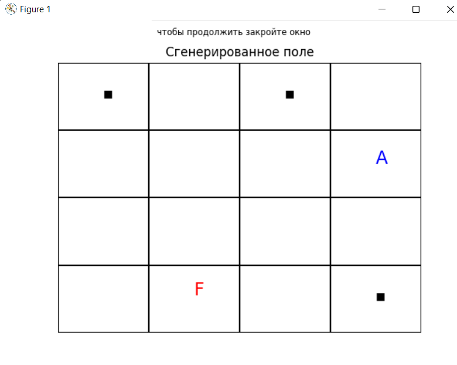
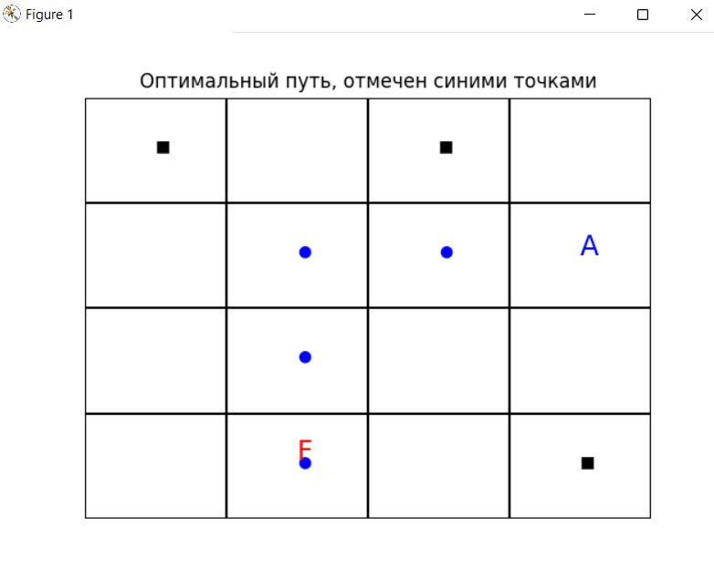
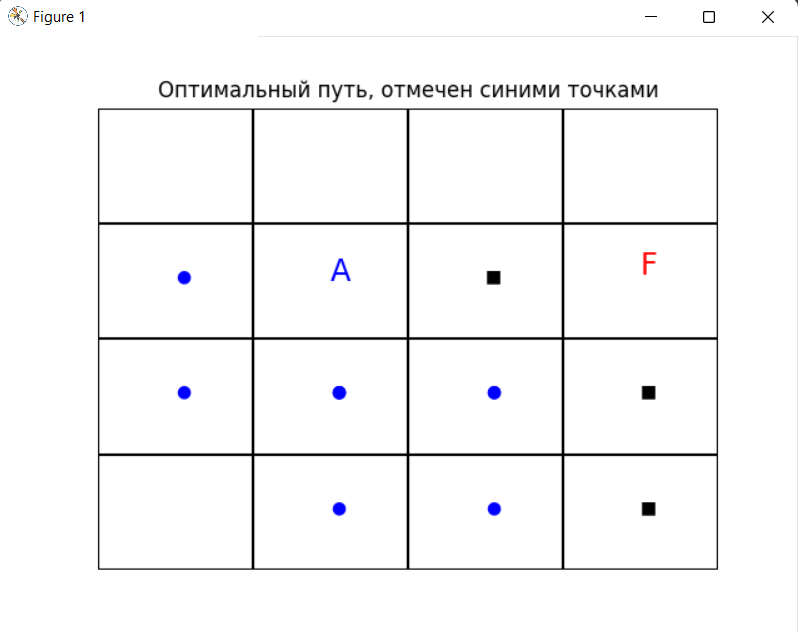

# Практическая работа ИСУ. УТС-41, Платонов Д.
Алгоритм в соответствии с заданием 4.11 №1 методички. Реализован алгоритм A*.  
## Что сделано?
Генерируется поле 4x4. Буквой "А" отмечено стартовое положение агента, красной буквой "F" финиш, то куда должен прийти агент. Черными квадратиками препятствия, синими точками оптимальный путь.
## Пример работы:

## Косяки/баги:
Как я понимаю, это недостаток алгоритма, поэтому не знаю нужно ли это фиксить.  
Если у агента 2 равнозначных пути и он выбирает тупиковый, то обратно он уже не возвращается.  
Например:  

